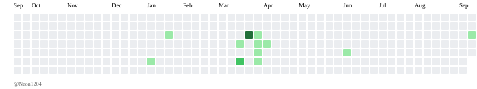

  

  <h1>XiangNi</h1>
  
前端开发者 · AI Agents 探索者 · 独立开发者

  
<em>时光流转，我在向前。</em>

  <a href="https://temporary-brisk-walnut-opal041.vercel.app/">博客</a> ·
  <a href="https://juejin.cn/user/3169251675879312">掘金</a> ·
  <a href="https://blog.csdn.net/XHN233">CSDN</a> ·
  <a href="https://www.cnblogs.com/NeonIs99/">博客园</a> ·
  <a href="mailto:15320237399@163.com">邮箱</a>

## 关于我

- 使用 Vue、React、TypeScript 和 SwiftUI 构建前端产品
- 探索 AI Agents、Python、RAG 与 AI 应用实践
- 分享工程决策、问题排查与跨端开发经验
- 欢迎交流技术、开源和独立产品

## 技术栈

  
  
  
  
  
  
  

## GitHub 动态

<picture>
  <source media="(prefers-color-scheme: dark)" srcset="./output/github-contribution-grid-snake-dark.svg" />
  <source media="(prefers-color-scheme: light)" srcset="./output/github-contribution-grid-snake.svg" />
  
</picture>

  <a href="./README.md">English</a>

